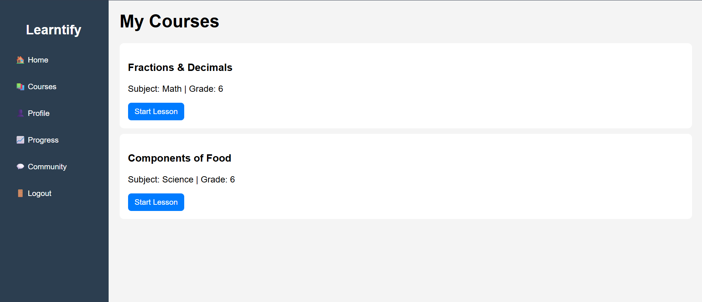

# Learntify Dashboard 🚀


---

## Overview
**Learntify** is a **responsive, user-friendly dashboard** for a learning platform.  
It allows users to navigate between **Home, Courses, Profile, Community, and Progress** sections with ease. Built with **pure HTML, CSS, and JavaScript**, the dashboard works **without a backend**.

> "Learn smart, track progress, and grow your skills with Learntify."

---

## Features ✨

- **Sidebar Navigation**: Smooth navigation between dashboard sections.
- **Dynamic Content**: JavaScript toggles page views dynamically.
- **Responsive Design**: Mobile-first, works on all screen sizes.
- **Personalized Experience**: Displays user information and welcome messages.
- **Lightweight**: No frameworks, just HTML, CSS, and JS.

---

## Pages 🖥️

| Page       | Description |
|------------|-------------|
| Home       | Personalized welcome message and dashboard overview. |
| Courses    | Displays enrolled courses. |
| Profile    | Shows user information and settings. |
| Community  | Interact with other learners. |
| Progress   | Track learning progress and achievements. |

---

## Live Demo 🌐

You can view the dashboard live using **GitHub Pages**:

1. Go to your repository on GitHub.
2. Click on `Settings → Pages`.
3. Select the branch `main` (or `master`) and `/root` folder.
4. Save and visit the URL provided.  

*(Example: https://yourusername.github.io/learntify-dashboard/)*

---

## Installation 💻

1. Clone the repository:

```bash
git clone https://github.com/yourusername/learntify-dashboard.git
````

2. Navigate to the project folder:

```bash
cd learntify-dashboard
```

3. Open `dashboard.html` in any browser.

---

## Demo Screenshot 📸




---

## Tech Stack 🛠️

* **Frontend**: HTML, CSS, JavaScript
* **Responsive Design**: Mobile-first layout
* **Static Implementation**: No backend required

---

## Author ✍️

**Shaik Jasmine**
Email: `usermail@gmail.com`

---

## License 📄

This project is **open-source** and licensed under the **MIT License**.


---


